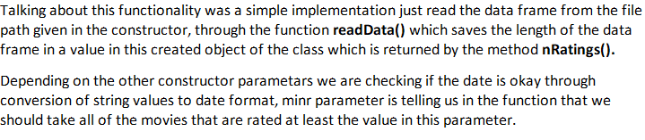
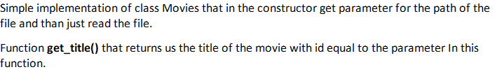
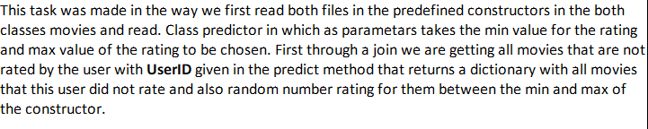
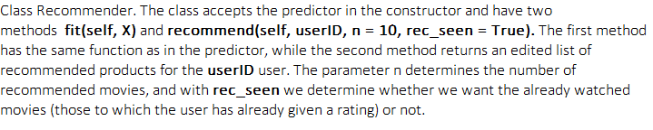
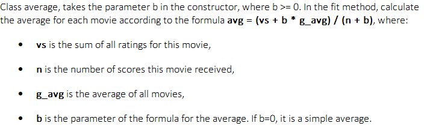
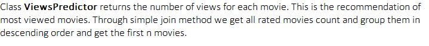
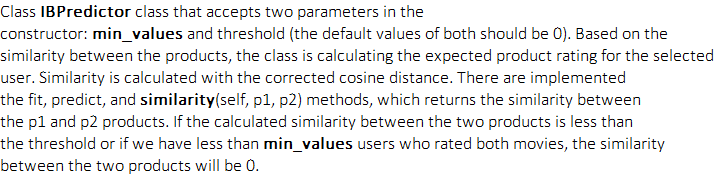
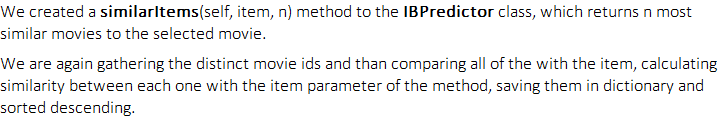
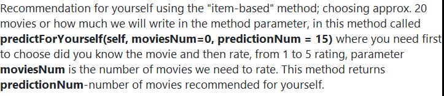

# MOVIES RECOMMENDER SYSTEM

## Setup development environment
1. Create environment (e.g. venv, conda, ...)
   - https://docs.python.org/3/library/venv.html

## Data
- You can use datasets from https://grouplens.org/datasets/movielens/
- Store them in root /

## Project structure
- \main.py
  - Entrypoint to configure and execute the system
- read.py
  - Reading Ratings
  
- movies.py
  - Reading Movies
  
- predictor.py
  - Random Predictor
  
- recommendation.py
  - Recommendation
  
- average.py
  - Average Predictor
  
- viewsPredictor.py
  - Recommending the most watched movies
  
- IBPredictor.py
  - Predicting scores with similarity between products
  
  - Recommendation based on the currently viewed content
  

## Recommendation for Yourself

  

## Execution
1. Comment or uncomment the tasks in `main.py` which you choose to run
2. Execute `python main.py`